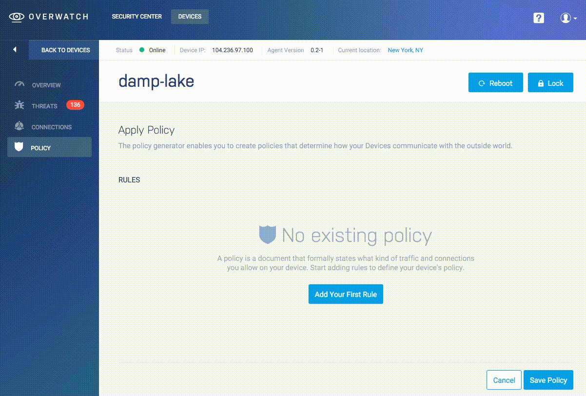
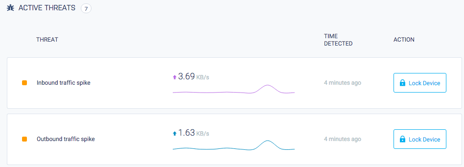

Overwatch is a security platform aimed at end users, it's purpose is to help keep track of your devices and servers preventing external access or detecting irregluar behavior that might otherwise go unnoticed.


## Overwatch Devices

Overwatch uses an installable client agent to monitor your devices, analyzing and logging it's regular behavior and enforcing the security rules that you configure on our web application. The term `Device` refers to any platform or physical hardware on which our client agent can be installed.

## The Overwatch Agent

Our agent runs as a service on your device, it's purpose is two-fold: it enforces any [Security Policy rules](#security-policies) that you've defined in the web application, and it sends regular status updates to the Overwatch servers for analysis.

The stats sent out by the agent include plain keepalives, inbound and outbound data traffic, open connections and general details such as the device's IP. The privacy of our user's data is very important to us, as such all communication between the agent and the Overwach server is encrypted, and while we do analyze the behaviour of the device - such as the amount of traffic exchanged between the device and the network, the actual data is never sent down the wire. If you have any concerns about privacy, please [get in touch](get-in-touch) and we'll be happy to discuss our security measures in more detail.

### Adding a Device

After creating your [Overwatch account](https://app.overwatchsec.com/auth/signup) you can follow the instructions at [our device onboarding page](https://app.overwatchsec.com/welcome) to run the agent installation script.

We keep the bootstrap script that handles installation in our supported packages publicly available, you can run it using the following command:

```bash
$ curl -L http://packages.overwatchsec.com/bootstrap.sh | bash
```

In order to keep communications between devices and Overwatch secure, each device is identified through an ssh key created at install time which will be shown on your device after running the bootstrap script; you can then either register the device in the Overwatch web wizard by copy/pasting the ssh key into the UI, or you can use the agent itself for device registration with it's [command line interface](#agent-command-line-usage).

Once the registration is complete your device will be able to connect to our servers, start sending health reports and download and enforce any security policies you set up for it.

### Agent command line usage

The Overwatch agent has a command line interface that allows you to perform basic administrative tasks, you should have the executable available as `overwatchd` in your `PATH`.

#### Register agent through CLI.

The agent can register itself without the need to access the Overwatch web.

##### Register interactively

```bash
$ sudo overwatchd --register --name "Media Center Raspberry Pi"
```

This will prompt an interactive email/password input and register the device under the ownership of the authenticating user, the `--name` flag is optional, Overwatch will generate a name if none is specified.

##### Register non-interactively

Alternatively, you can specify a `--token <token>` to skip the interactive prompt, this token is associated to your account and will also register the device under your user, this is specially useful when installing the agent in bulk on multiple devices.

```bash
$ sudo overwatchd --register --name "Smoke detector" --token Xdj2kdlajk3dfjsk2j31hdlrgk3od12isdjiqk2m22i3jdfui
```

##### Get registration token

You can get your registration token at any time with the `--get-token` flag, it will ask for login credentials interactively.

```bash
$ overwatchd --get-token
```

##### Regenerating identity file

You can recreate the ssh identity keys at any point, if you do you will need to register the device again, as it will appear to Overwatch as a completely new and unrelated device.

```bash
$ sudo overwatchd --generate-keys --override
```

#### Starting the agent manually

The Overwatch agent is installed as a service on your device, as such, you'll be able to issue standard service commands to control it's behavior.

##### On Upstart systems.
```bash
$ sudo service overwatchd start
$ sudo service overwatchd restart
$ sudo service overwatchd stop
```

#### Supported Devices

Overwatch bootstrap script currently supports:

* upstart-based Ubuntu Linux (by default, Ubuntu 14.10 and older)

We have plans to support additional IoT focused platofrms and hardware and in the near future. In the meantime, if you'd like to run Overwatch in a platform that is not listed here [let us know](get-in-touch) and we'll look into adding it to our bootstrap process.

## The Overwatch Web Interface

### The Security Center

The security center is a high-level overview of all your devices, and it's the root view of our web interface when you're logged into your account.

On it you'll see an aggregate view of all alerts, threats, connections and overall threat level of all the devices registered under your account.


### The Device List

You can see a list of all devices registered under your account along with a summary of their current status in your [devices page](https://app.overwatchsec.com/devices).

### The Device View

The device view contains an overview of your device activity, on it you'll see a summary of [alerts](#alerts), [threats](#threats), and [currently open connections](#connections). Here you'll also be able to perform security [actions](#actions) on the device.


#### Actions

You can send commands to your device via the Overwatch web interface, keep in mind that for the device to execute these commands it needs to be able to connect to the Overwatch server, in cases where a device is offline Overwatch will enqueue the action and push it into the device as soon as it regains a secure connection.

##### Device Reboot

The Reboot button sends a reboot signal from the Overwatch server into the device agent, which forwards it to the host operating system. A rebooted system should come back online in Overwatch after a few seconds or minutes depending on your device hardware.

##### Lock Device

The device lock function instructs the agent to block any outbound or inbound connections from your device except for the secure connection to the Overwatch server, you can use it to stop undesired access on a compromised device or simply to keep it secure until you can examine it further if you see any irregularities in its behaviour.

###  Alerts

Alerts are notable events that happen to your device, they don't necessarily signify that a system has been compromised, but simply inform you of activity that might require your attention, like changes in the device connectivity data, potential security vulnerabilities (even though they might not be currently exploited) or the need take security measures like upgrading your security software.

### Security Policies

The security policies page for your device is accessible through the left-hand navigation column (presented as "Policy"), from this page you can set the criteria by which most threats are evaluated as well as restrict the type of outbound and inbound traffic that your device is capable of performing.

Threats are heavily influenced by the policies you configure for your device, we recommend going to the policy page of every new device to set up sensible policies depending on the device's intended regular usage.



### Threats

Threats signify an irregular occurrence on your device; there are different types of threats depending on the specific irregular behavior, but in general, treat them with care and analyze them to determine if they are within your accepted use of the device or if they might be caused by malicious access from a third party.

Threats are triggered based both on the security policies for the device and on significant deviations in behavior as observed by Overwatch: unusual traffic spikes or number of open connections are some of the events that might trigger a threat in a given device.

If a high number of perceived threats has been detected on one of your devices, you might want to head over to the Threats page from the left menu in order to see a complete list.



### Connections

The device overview includes a list of currently open connections detected in your device, along with details such as IP, ports used, protocol type of the connection along with geolocalization data when available, keep in mind that this list will include the secure connection to the Overwatch servers.

For a complete list of all connections go to the "Connections" page on the left navigation menu.

[get-in-touch]: mailto:inquiries@overwatchsec.com
